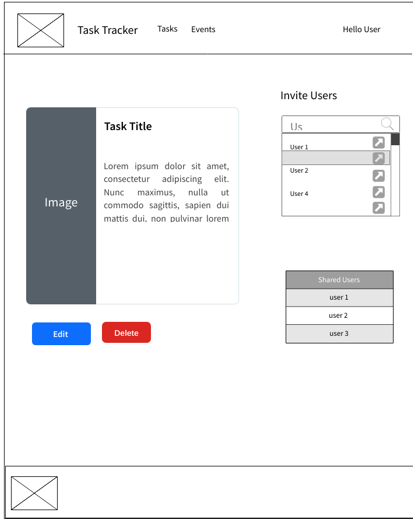
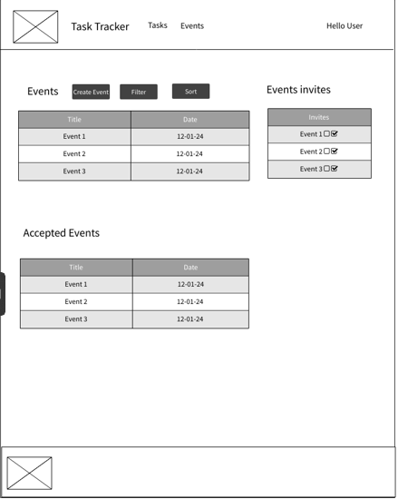

# Task Tracker

Task Tracker is an intuitive solution to tracking your everyday tasks and managing events.

The objective of this site is to help people increase their day-to-day productivity by organizing their tasks in one place.

This project was aligned with the tasktracker-api project. The API was built using Django Rest Framework and is available [HERE](https://github.com/scottsmyth56/tasktracker-api).

The Deployed Site is available [HERE](https://tasktracker-app-273d99460b58.herokuapp.com/)

## Table of Contents

- [Task Tracker](#task-tracker)
- [Table of Contents](#table-of-contents)
- [UX](#ux)
  - [Site Goal](#site-goal)
  - [Audience](#audience)
  - [Current User Goals](#current-user-goals)
  - [New User Goals](#new-user-goals)
  - [Agile Planning](#agile-planning)
  - [Event Planning and Networking](#event-planning-and-networking)
- [Design](#design)
  - [Logo](#logo)
  - [Colour](#colour)
  - [Typography](#typography)
  - [Layout](#layout)
  - [Wireframes](#wireframes)
- [Features](#features)
  - [Current Features](#current-features)
  - [Future Features](#future-features)
- [Testing](#testing)
  - [HTML Validation](#html-validation)
  - [CSS Validation](#css-validation)
  - [Es Lint Validation](#es-lint-validation)
  - [Lighthouse Testing](#lighthouse-testing)
  - [Manual Tests](#manual-tests)
  - [Unfixed Bugs](#unfixed-bugs)
  - [Encountered Bugs](#encountered-bugs)
- [Technologies Used](#technologies-used)
  - [Languages Used](#languages-used)
  - [Components](#components)
  - [External Programs and Libraries Used](#external-programs-and-libraries-used)
- [Deployment](#deployment)
- [Credit](#credit)
  - [Media](#media)
  - [Code](#code)

## UX

### Site Goal:

- To create an intuitive, engaging platform that allows users to manage their tasks and events with ease. The goal is to facilitate better personal and team productivity by offering a streamlined way to track deadlines and prioritize work

### Audience:

The primary audience for this site includes professionals, students, and anyone with a need for structured task management. It is very beneficial for anyone looking for a centralized system to coordinate tasks and events.

### Current User Goals:

- Seamlessly manage personal and professional tasks in one centralized location.
- Share and delegate tasks with others to foster collaboration and accountability.
- Register for events and manage event participation within their networks.

### New User Goals:

- Quickly learn and integrate the platform into their daily routine to enhance productivity.
- Leverage advanced features such as task prioritization, scheduling, and filtering to create an efficient workflow.

### Agile Planning:

- The development of the app followed an agile approach, using iterative cycles to ensure that the final product meets the real needs of its users. The User stories below were frequently reviewed and updated on the Kanban board throughout the project to keep track of progress.

User Stories

#### User Story #1: Create Tasks
- As a registered user, I want to create new tasks, so that I can keep track of things I need to do.
  
  **Acceptance Criteria:**
  - Users must be logged in to create a task.
  - Users can enter a title, description, due date, priority, and category for each task.
  - Users can submit the new task to the system where it is then visible in their task list.

#### User Story #2: Edit Tasks
- As a registered user, I want to edit my tasks, so that I can update task details as needed.
  
  **Acceptance Criteria:**
  - Users can select a task from their task list to edit.
  - Users can change the title, description, due date, priority, and category of the task.
  - Changes are saved and reflected in the task list upon submission.

#### User Story #3: Delete Tasks
- As a registered user, I want to delete tasks, so that I can remove tasks that are no longer relevant.
  
  **Acceptance Criteria:**
  - Users can select a task and remove it from their task list.
  - The system prompts for confirmation before permanently deleting the task.

#### User Story #4: Share Tasks
- As a registered user, I want to share tasks with other users, so that we can collaborate on common tasks.
  
  **Acceptance Criteria:**
  - Users can share a task by entering another user's username or selecting from a list of users.
  - Shared users receive a notification about the new task shared with them.

#### User Story #5: Filter Tasks
- As a registered user, I want to filter tasks by status and priority, so that I can easily organize and prioritize my workload.
  
  **Acceptance Criteria:**
  - Users can filter the task list by different statuses (e.g., To Do, In Progress, Done).
  - Users can filter the task list by priority (e.g., Low, Medium, High).

#### User Story #6: Create Events
- As a registered user, I want to create events, so that I can organize meetings or activities with other users.
  
  **Acceptance Criteria:**
  - Users can create an event with a title, description, date, time, and location.
  - Once created, the event is visible in the user's event list.

#### User Story #7: Edit/Delete Events
- As the owner of an event, I want to edit or delete the event, so that I can manage events I've created.
  
  **Acceptance Criteria:**
  - Event owners can edit all details of their events.
  - Event owners can delete their events with confirmation.

#### User Story #8: Manage Event Invitations
- As the owner of an event, I want to invite other users to my event, so that they can participate in the scheduled activity.
  
  **Acceptance Criteria:**
  - Event owners can send invitations to other users by username.
  - Invited users receive a notification of the invitation.

#### User Story #9: Respond to Event Invitations
- As a registered user, I want to see a list of event invitations and have the option to accept or decline, so that I can manage my participation in events.
  
  **Acceptance Criteria:**
  - Users can see a list of their event invitations.
  - Users can accept an invitation, which adds the event to their list of accepted events.
  - Users can decline an invitation, which removes it from their invitation list.

#### User Story #10: View Event Acceptances
- As an event owner, I want to see who has accepted my event invitation, so that I can know who will be attending.
  
  **Acceptance Criteria:**
  - Event owners can view a list of users who have accepted their event invitations.
  - The list updates in real-time as users respond to invitations.

#### User Story #11: View All Tasks
- As a registered user, I want to view a list of all my tasks, so that I can get an overview of what I need to work on.
  
  **Acceptance Criteria:**
  - Users can see a comprehensive list of tasks upon navigating to the task page.
  - The task list displays all relevant details such as title, due date, priority, and status.
  - Tasks can be sorted or filtered based on different criteria like due date or priority.

#### User Story #12: Task Details
- As a registered user, I want to click on a task to view its details, so that I can understand what the task involves and its current status.
  
  **Acceptance Criteria:**
  - Users can select a task to view more detailed information.
  - The detailed view includes the task description, due date, assigned users, and any comments or updates.

#### User Story #13: View All Events
- As a registered user, I want to view a calendar or list of all my events, so that I can plan my schedule.
  
  **Acceptance Criteria:**
  - Users can access a calendar or event list from the main navigation.
  - The calendar or list provides an overview of all upcoming events.
  - Users can select an event to view more details, such as time, location, and participants.

#### User Story #14: Event Details
- As a registered user, I want to click on an event to view its details, so that I can see the agenda and other important information.
  
  **Acceptance Criteria:**
  - Users can select an event to view detailed information including the event agenda, location, and who else is attending.

### Event Planning and Networking:

- A key feature of the application is the ability to create, manage, and participate in events. Users can:
  - Easily create events related to their tasks or interests and invite other users.
  - Accept invitations to events, see who is attending, and manage their event calendar.

## Design

### Logo:

During the design process I decided I wanted to go with a very subtle logo. This is to avoid distraction but give the user enough indication at first glace
on the sites purpose and goal

### Colour:

The aim of the colour scheme was to provide a calming user experience to the site. This is achieved through the implementation of gradients and blue shades.

    
Click to see Colour Palette

    

### Typography

The main typography used throughout the site was `Roboto`.This was chosen to provide clear information to the user but also provide a nice aesthetic The font works well in all weights and looks professional throughout.

### Layout

The goal of the layout for this site was to provide easy navigation and to distuingish between the sites elements with ease. This is achieved through the use of bootstrap layout and bootstrap cards. I designed the pages with similiar layout as some of the features have similiar workflow. Meaning the user knows intuitively where each action is performed.

### Wireframes

The Wireframes for the site layout can be viewed below

  
 Click to see Site Wireframes

#### Task Page Wireframe

#### Task Wireframe

#### Event Page Wireframe

#### Event Wireframe

#### Event Creation Wireframe

#### Task Creation Wireframe

## Features

### Current Features

#### Task List
This is the home page for the user after a successful login, where the user can see their own created tasks. Users can also see tasks that others have shared with them. If a user has a lot of tasks, they can easily filter by priority or status.

- Links to [User Story #11: View All Tasks](#user-story-11-view-all-tasks)

  
Click to view Task List 

  
  

#### Detailed View of Task
This is the detailed view of each individual task. Here users can see all details relative to the task and can also edit and delete the task.

- Links to [User Story #12: Task Details](#user-story-12-task-details)

  
Click to view Detailed Task 

  
  

#### Event Page
This is where users can see all events they have created and events they have been invited to. Users can also see all the events they have accepted in a separate list.

- Links to [User Story #13: View All Events](#user-story-13-view-all-events)

  
Click to view Event Page 

  
  

#### Event Detailed View
This is the view of each individual event. Here users can see all details relative to the event and can also edit and delete the event. Users can also see who has accepted the event.

- Links to [User Story #14: Event Details](#user-story-14-event-details)

  
Click to view Event Detailed 

  
  

#### Login
This feature allows users to login to the site. Users can also visit the registration page if they do not have an account.

- Links to [User Story #15: User Authentication](#user-story-15-user-authentication)

  
Click to view Login 

  
  

#### Registration
This feature allows users to register to the site. Users can also visit the login page if they already have an account.

- Links to [User Story #16: User Registration](#user-story-16-user-registration)

  
Click to view Registration 

  
  

#### Task Creation
This feature allows users to create a task.

- Links to [User Story #1: Create Tasks](#user-story-1-create-tasks)

  
Click to view Task Creation 

  
  

#### Event Creation
This feature allows users to create an event.

- Links to [User Story #6: Create Events](#user-story-6-create-events)

  
Click to view Event Creation 

  
  

#### Delete Confirmation
This feature allows users to confirm they want to delete a task or event.

  
Click to view Delete Confirmation 

  
  

#### Task Invite
This feature allows users to invite other users to a task.

- Links to [User Story #4: Share Tasks](#user-story-4-share-tasks)

  
Click to view Task Invite 

  
  

#### Event Invitations
This feature allows users to see all event invitations they have received and either accept or decline them.

- Links to [User Story #9: Respond to Event Invitations](#user-story-9-respond-to-event-invitations)

  
Click to view Event Invitations 

  
  

### Future Features

- Authenticated Forgot Password
- Comments on Tasks
- Collaborative Tasks
- Task Reminders
- Task Scheduling
- Task Prioritization
- Integrate useful API's like Google Calendar

## Testing

### HTML Validation

After Validating the HTML  code throughout and making final changes. The HTML code has no issues throughout.

### CSS Validation

CSS passed validation with no errors.

### Es Lint Validation

All JSX code was validated and checked throughout using pretier code formatter and es lint. No errors were found after final changes.

### Lighthouse Testing

Lighthouse was used to test the performance of the site. The results were very good throughout.

### Manual Tests

| Test Case # | Description                       | Steps                                                                                      | Expected Result                                              | Actual Result |
|-------------|-----------------------------------|--------------------------------------------------------------------------------------------|--------------------------------------------------------------|---------------|
| 1           | User Registration                 | 1. Navigate to "/register". 2. Fill out and submit the form.                           | User is registered and redirected to the login page.         | Works         |
| 2           | User Login                        | 1. Navigate to "/login". 2. Enter credentials and submit.                              | User is logged in and redirected to the homepage.            | Works         |
| 3           | Create Task                       | 1. Navigate to "/createTask". 2. Fill out and submit the task creation form.           | New task is created and listed on the task list.             | Works         |
| 4           | Edit Task                         | 1. Click on a task. 2. Modify details and submit changes.                              | Task details are updated.                                    | Works         |
| 5           | Delete Task                       | 1. Click the delete button on a task. 2. Confirm deletion.                             | Task is removed from the task list.                          | Works         |
| 6           | Share Task                        | 1. Click the share button on a task. 2. Enter username and share.                      | Task is shared with the selected user.                       | Works         |
| 7           | Filter Tasks                      | 1. Use the filter options to select status/priority.                                      | Task list updates to show only filtered tasks.               | Works         |
| 8           | Create Event                      | 1. Navigate to "/createEvent". 2. Fill out and submit the event creation form.         | New event is created and listed.                             | Works         |
| 9           | Edit/Delete Event                 | 1. Click on an event. 2. Edit details or delete and confirm.                           | Event details are updated or event is deleted.                | Works         |
| 10          | Invite Users to Event             | 1. Click the invite button on an event. 2. Enter usernames and send invitations.       | Invitations are sent to selected users.                      | Works         |
| 11          | Respond to Event Invitations      | 1. Navigate to invitations list. 2. Accept or decline an invitation.                   | Invitation is accepted/declined and list updates.            | Works         |
| 12          | View Event Acceptances            | 1. Click on an event. 2. View the list of accepted users.                              | The list of users who accepted the invitation is displayed.  | Works         |

### Unfixed Bugs

- Accept Invite - when a user accepts an invite, sometimes it won't add the user to the event. This happens right after creating an event and inviting the user straight away. The issue relates to an ID on the invitation not being found. A possible solution to this would be to add a check to see if the ID exists before adding the user to the event. Due to time constraints this was not fixed.

##### Encountered Bugs

- Handling Multiple Images - At the beginning of the project I had some issues with saving multiple images to the Database, This was down to the way I had the model set up. I decided to just go with a single ImageField for the project. This was due to time constraints and the fact that the project is not image heavy.

- Duplicated Toast Messages - When a user creates a task or event, a toast message is displayed to the user. I noticed that sometimes the message would be duplicated. This was fixed by adding a check to see if the message was already displayed. If it was, it would not be displayed again.

- Protected Routes - I was trying to create a custom component that would check if a user is authenticated before allowing them to access a route. I was having issues with this and decided to go with a different approach. I ended up adding a check in a useEffect hook to see if the user was authenticated. If not, they would be redirected to the login page.

## Technologies Used

### Languages Used

- HTML5
- CSS3
- JavaScript

### Components

#### `<UserSearch />` Component Overview

The `UserSearch` component in the application serves as a dynamic search tool, allowing users to search for and invite other users to tasks. It is designed for reusability across different parts of the application where similar functionality is needed.

#### Key Features and Implementation:

- **Search Functionality:**
  - The component provides an input field for users to enter a search term.
  - It leverages `axios` for making HTTP requests to fetch users based on the search term.
  - The search is performed against a backend endpoint (`/search-users/`) which returns a list of users matching the search query.

- **Debounced Search:**
  - The search functionality incorporates `debounce` from `lodash`, enhancing performance and user experience.
  - Debouncing ensures that the backend is not inundated with requests; it waits until the user has stopped typing for a brief period (300ms in this case) before sending the search request.
  - This approach reduces the number of unnecessary API calls and provides a smoother user experience.

- **Dynamic User Listing:**
  - The component dynamically lists users matching the search term using a `ListGroup` from `react-bootstrap`.
  - Each user item in the list includes an "Invite to Task" button, allowing the logged-in user to invite the selected user to a task.

- **Handling No Results:**
  - The component gracefully handles situations where no users are found by displaying a message ("No users found").

- **Reusability:**
  - The `UserSearch` component is designed to be reusable across different parts of the application.
  - It accepts a prop `onSelectUser`, which is a function that defines what happens when a user is selected from the search results. This design allows for different behaviors based on where the component is used.

- **PropTypes for Validation:**
  - The component uses `PropTypes` to validate its props, ensuring that `onSelectUser` is provided and is a function, enhancing the robustness and reliability of the component.

#### Usage in Application:

- **Task Sharing:**
  - One primary use of the `UserSearch` component is in the task-sharing feature, where users can search for others to share a task with.

- **Event Invitations:**
  - The component can also be integrated into event management features, allowing users to search for and invite others to events.

#### Conclusion:

The `UserSearch` component stands as a versatile and efficient element in the application, providing essential search and invitation functionality with a focus on performance and user experience.

#### NotFoundPage Component Overview

The `NotFoundPage` component is a simple yet essential part of the application, designed to handle scenarios where a user navigates to a URL that does not correspond to any page in the app.

### Features:

- **404 Not Found Message:** 
  - Displays a clear and concise message "404 - Not Found!" indicating that the requested page does not exist.
  - This message helps users understand that they might have followed a broken link or mistyped a URL.

- **Instructions for Users:**
  - Provides a helpful suggestion to users, guiding them back to the homepage of the application.
  - Includes a link to the homepage, styled with an underline for emphasis and ensuring it is visible against the background.

- **Responsive Layout:**
  - Uses React Bootstrap's `Container`, `Row`, and `Col` components to ensure the layout is responsive and adapts to different screen sizes.

- **Styling:**
  - The text is styled to be white, ensuring it is readable on various background colors.
  - Margins and padding are adjusted to position the text appropriately on the page.

### Usage:

This component is typically used in routing configurations as a fallback for undefined routes, ensuring a user-friendly response to navigation errors.

## SpinnerButton Component Overview

The `SpinnerButton` component is a UI element that combines a React Bootstrap `Button` with a `Spinner`. It's used to indicate a loading state or processing action to the users.

### Key Features:
- **Button with Spinner:** Incorporates a `Spinner` inside a `Button` to visually represent an ongoing process.
- **Disabled State:** The button is disabled while loading, preventing user interactions during processing.
- **Accessibility:** Includes `role` and `aria-hidden` attributes for screen reader accessibility.

### Usage:
Ideal for situations like form submissions or data fetching where there is a delay in response or processing, providing users with immediate visual feedback.

### Example in Application:
Used across the application wherever an action triggers a process that requires the user to wait.

#### DeleteTaskModal Component Overview

The `DeleteTaskModal` component is a React component that provides a confirmation dialog for deleting a task. It utilizes React Bootstrap's `Modal` and `Button` components.

### Features:
- **Modal Dialog:** Shows a modal asking for confirmation before deleting a task.
- **Delete Function:** The `deleteTask` function calls an API to delete the task and navigates the user back to the home page after deletion.
- **Toast Notification:** Displays a success message using `toast` from `react-toastify` upon successful deletion.
- **Prop Validation:** Uses `PropTypes` to validate `taskId` as a required number.

### Usage:
This component is used to provide a safe way to delete tasks, ensuring that users confirm their intention before a task is permanently removed.

### Integration:
Triggered by a "Delete Task" button, which opens the modal for confirmation.

###  Project Dependencies Overview

### Core Dependencies
- `react`: The React library is used for building the user interface components.
- `react-dom`: Provides DOM-specific methods used in a web app to interact with the DOM.
- `react-scripts`: A set of scripts from the Create React App to help with project setup and build processes.

### Routing
- `react-router-dom`: Manages navigation and rendering of components in different URLs in a React web application.
- `react-router-bootstrap`: Integration of React Router with React-Bootstrap, used for navigating through React Router with React-Bootstrap components.

### State Management
- `react-redux`: A library for managing and centralizing application state using React.

### UI Framework
- `bootstrap`: A front-end framework for developing responsive and mobile-first websites.
- `react-bootstrap`: Integration of Bootstrap with React, offering Bootstrap components as React components.

### Utility Libraries
- `axios`: A Promise-based HTTP client for making HTTP requests from node.js or XMLHttpRequests from the browser.
- `date-fns`: A library for handling dates and times in JavaScript.
- `lodash`: A modern JavaScript utility library delivering modularity, performance & extras.

### Testing Libraries
- `@testing-library/react`: Simple and complete React DOM testing utilities that encourage good testing practices.
- `@testing-library/jest-dom`: Custom jest matchers to test the state of the DOM (used with React Testing Library).
- `@testing-library/user-event`: Simulate user events for testing purposes in React applications.

### Notifications
- `react-toastify`: Allows you to add notifications to your app with ease. I used these for displaying succes or warning messages to the user throughout the app. 

### Type Checking
- `prop-types`: Used to document the intended types of properties passed to components in React and will warn in development if they are not matched.

### External Programs and Libraries Used

- Google Fonts - for the font family.
- Font Awesome - to add icons throughout the site.
- GitPod - to creat my html files & styling sheet before pushing the project to Github.
- Visual Studio - For all Development work
- Postman - to test the API endpoints
- Favicon - to provide the code & image for the icon in the tab bar.
- MockFlow Wireframe - to create Wireframes for the site layout.
- Cloudinary - used to host static and media files
- ElephantSQL - used to host postgres database used in project.

## Deployment

The Site was deployed using Heroku Hosting Platform. A really powerful platform at that.

### Deployment Steps

#### React App Steps
- Add a Procfile to the root of the project with the following content: web: serve -s build
- Add your deployed API URL to the axios requests in the project
- Run npm run build to create a production build of the project
#### Heroku Steps
- Create a new project on Heroku
- Connect Github Repo
- In settings, configure Environment Variables lilke Database URL, Cloudinary URL etc..
- In Deploy, configure your automatic deploys or not.
- Deploy App

### Cloning for Further Development(Codeanywhere)

- Open Codeanywhere.
- Click on "File" in the top menu bar, then select "New Connection" > "From Git, GitHub, Bitbucket, Gitlab, URL".
- In the pop-up dialog box, paste the repository URL you want to clone: https://github.com/scottsmyth56/tasktracker-app.git and click "Next".
- Give your new connection a name and click "Create".
- Codeanywhere will create a new container with your cloned repository. It may take a few minutes.
- Once it's done, click on the "Folder" icon on the left sidebar to find your cloned repository.
- You can start working on the codebase, make changes and save them.
- When you are ready to push your changes, right click on your container and select "SSH Terminal" to open the terminal.
- In the terminal, navigate to your project folder (if you're not already there).
- Run git add . to add all the changes.
- Commit your changes by running git commit -m "your commit message".
- Push your changes by running git push.

### Cloning for Further Development ( Locally )

- Make sure you have Git installed on your computer. If you don't have it already, you can download it from the official website (https://git-scm.com/)
- Open a terminal window (on Windows, Git Bash is a good option)
- Navigate to the directory where you want to clone the repository using the cd command. For example, to navigate to the Documents folder, you would use the command cd Documents.
- Use the following command to clone the repository: git clone https://github.com/scottsmyth56/tasktracker-app.git
- The command will create a new directory called "tasktracker-app" in the current directory, and will copy all the files from the repository into that directory.
- Navigate into the newly cloned directory by running cd tasktracker-app
- you can check the content of the cloned repository by running ls command
- Make sure to update your local copy with the remote repository by running git pull command
- you can start to use the cloned repository as you wish

## Credit

### Media

### Imagery

- Background images sourced from https://www.pexels.com/.

Icons sourced from:

- https://icons8.com/
- https://fontawesome.com/

### Code

- useNavigate hook from https://reactrouter.com/web/api/Hooks
- useLocation hook from https://reactrouter.com/web/api/Hooks
- useParams hook from https://reactrouter.com/web/api/Hooks
- Toast Alerts from https://fkhadra.github.io/react-toastify/introduction/
- React Bootstrap from https://react-bootstrap.github.io/

